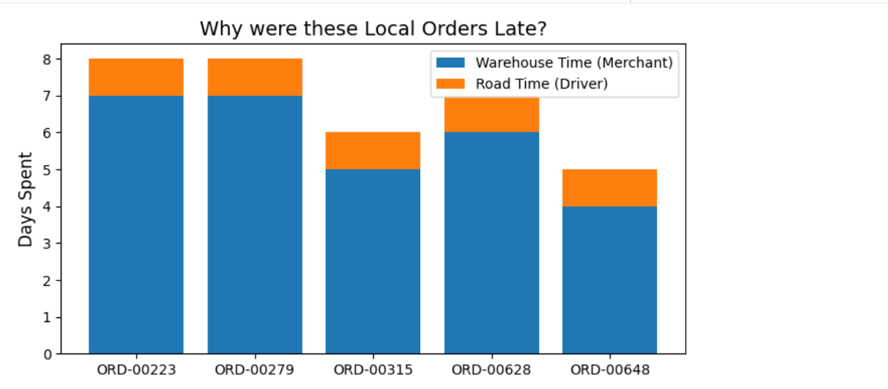

# Logistics Delivery Bottleneck Analysis (Root Cause Analysis)
Finding Bottlenecks at Supply chain level
I stopped blaming the driver for my late deliveries.

We’ve all had that frustration: checking an app for a package that was supposed to arrive yesterday and imagining the truck stuck in a massive traffic jam.

While analyzing 10k orders from a logistics dataset, I wanted to see if that "traffic jam" was actually the problem. Or was it something else?

Context: The "Late Delivery" tag is a heavy one that usually hurts the logistics team's reputation. I conducted a Root Cause Analysis to see exactly where the clock stops. Is it the Driver (Transit) or the Merchant (Processing)?

I didn't just look at the final delivery date. I used SQL to "split the clock" into two phases:

The Warehouse Phase: Time from order approval to hand-off to the carrier.

The Road Phase: Time from the truck leaving to hitting the customer's doorstep.

To keep the analysis fair, I used Python to isolate "local" orders where the distance was under 15km. If a 10km trip takes 3 days, one can’t blame the highway. For these 194 local orders:

The average processing (warehouse) time was approximately 2.37 days. The average delivery (road) time was approximately 1.05 days. The "Aha!" Moment:

The Bottleneck: Our initial SQL query on late orders (distance < 50km) showed that for the first few examples, the root_cause was consistently a 'Merchant Bottleneck', indicating the package spent significantly more time in the warehouse.

Even for local trips, data shows that the warehouse processing time is, on average, more than double the road delivery time. This points to the warehouse as the primary area for improvement.

My Recommendation: At this point, my recommendation wouldn't be "buy faster trucks." That’s expensive and ignores the root cause. The high-value fix is Merchant Incentives and process optimization at the warehouse level. By rewarding sellers who dispatch quickly and streamlining warehouse operations, the delay is solved before the driver even arrives.
# 🚛 Stop Blaming the Driver: Supply Chain Bottleneck Analysis

We’ve all been there: frustrated, checking a delivery app, and imagining our package stuck in a massive traffic jam. But is the "traffic jam" actually the problem? 

This project performs a **Root Cause Analysis (RCA)** on 10,000+ logistics orders to determine if late deliveries are caused by **Transit Failures** or **Merchant Processing Bottlenecks**.

---

## 🧠 The Project Overview
The "Late Delivery" tag is a heavy one that usually hurts a logistics team's reputation. To keep the analysis fair and isolate the variables, I used Python to focus on **"local" orders** (distance < 50km). If a short-distance trip takes days, the highway isn't the problem.

### The Methodology: "Splitting the Clock"
I used SQL to divide the delivery timeline into two distinct phases:
1. **The Warehouse Phase:** Time from order approval to hand-off to the carrier.
2. **The Road Phase:** Time from the carrier picking up the package to the customer's doorstep.

---

## ⚙️ Analytical Logic (SQL)
Using **SQLite**, I implemented a `CASE` statement to compare the two phases. If the Warehouse Phase outweighed the Road Phase, the order was flagged as a **'Merchant Bottleneck'**.

---

## 📊 Key Findings: The "Aha!" Moment

After analyzing 194 short-distance failures, the data revealed a startling reality:
* **Average Warehouse Phase:** ~2.37 Days
* **Average Road Phase:** ~1.05 Days

**The Conclusion:** Even for local trips, warehouse processing time is, on average, **more than double** the actual delivery time.

### Deep Dive: Top Late Orders
When we look at the specific distribution of days spent for the most delayed local orders, the **Merchant/Warehouse time (Blue)** consistently dwarfs the **Driver/Road time (Orange)**.

---

## 🛠️ Processed Data Output
The final transformed dataset identifies the root cause for every late delivery, allowing the business to stop blaming drivers and start addressing the actual source of the delay.

---

## 🚀 Strategic Recommendations
The high-value fix isn't "buying faster trucks"—that’s expensive and ignores the root cause. My data-driven recommendations are:

1. **Merchant Incentives:** Reward sellers who dispatch packages within 24 hours.
2. **Process Optimization:** Streamline warehouse hand-off protocols to reduce the 2.37-day average hold time.
3. **Targeted Support:** Provide better logistics tools for "Merchant Bottleneck" outliers to solve the delay before the driver even arrives.

---

## 🧰 Tech Stack
* **Language:** Python (Pandas, Matplotlib)
* **Database:** SQL (SQLite)
* **Environment:** Jupyter Notebook
